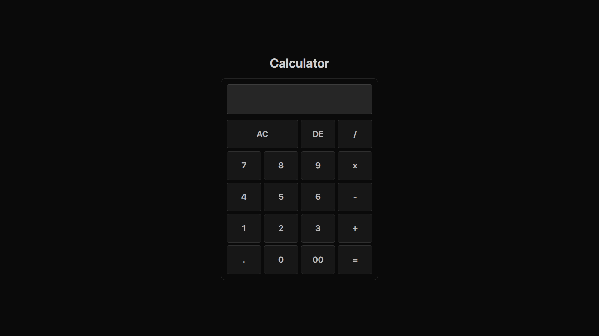

# 🧮 Calculator That Charges $67

A Full Stack calculator that works normally until the result equals **67**.  
When it does, a **Stripe checkout** appears and charges $67.

Because why not.

## Screenshots



## Tech Stack
- React + TypeScript (Vite)
- Tailwind CSS
- Stripe Elements
- Node.js + Express
- Stripe Payment Intents

## How It Works
1. User performs a calculation
2. If result ≠ 67 → normal calculator
3. If result = 67 → Stripe payment flow is triggered

## Local Setup

### Backend
```bash
npm install
npm run dev
```

### .env
```bash
STRIPE_SECRET_KEY=sk_test_*****
```

### Frontend
```bash
npm install
npm run dev
```

### .env
```bash
STRIPE_PUBLISHABLE_KEY=pk_test_*****
```
### Deployment
Backend: Render (Web Service)
Frontend: Render (Static Site) or Vercel
Secrets stay on the backend